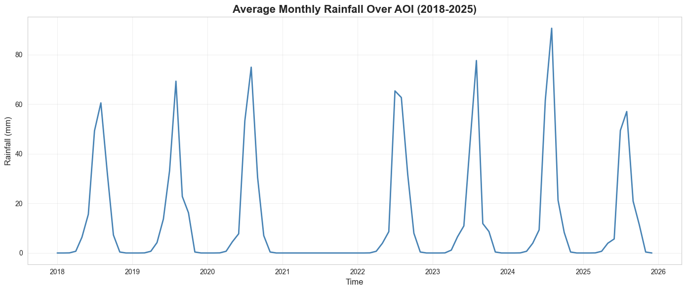
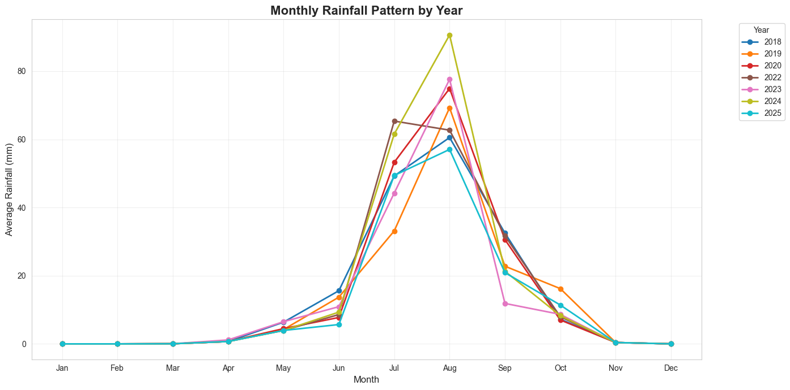
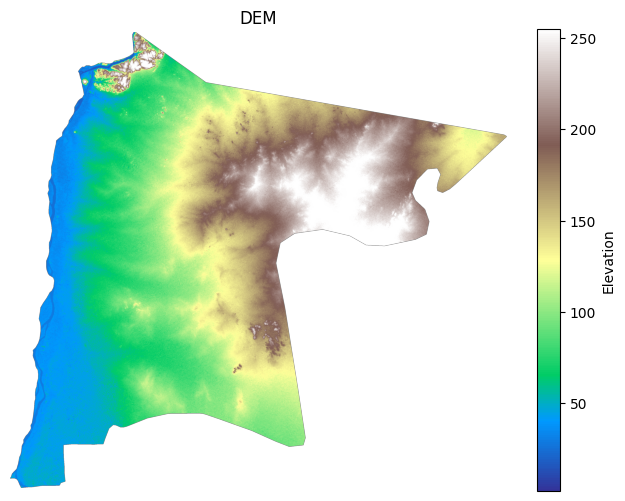
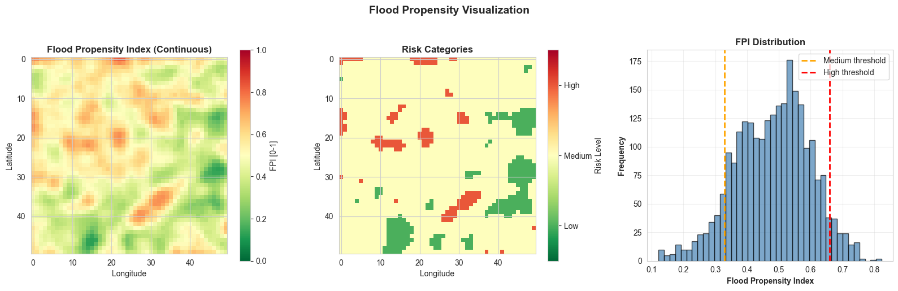
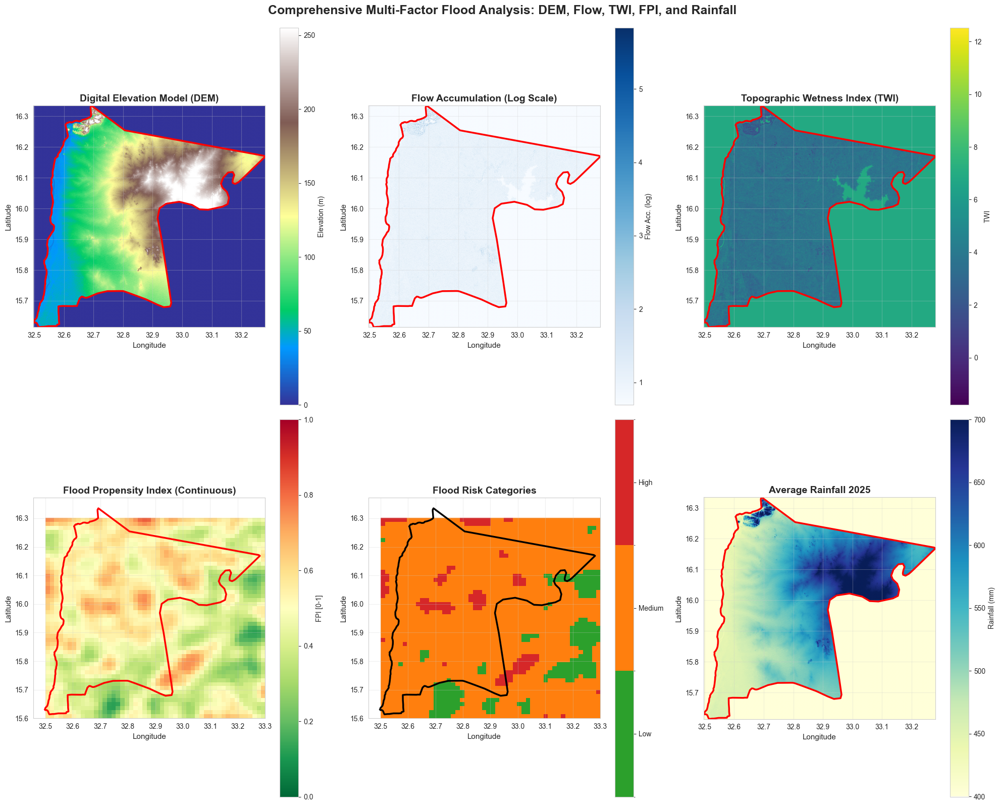
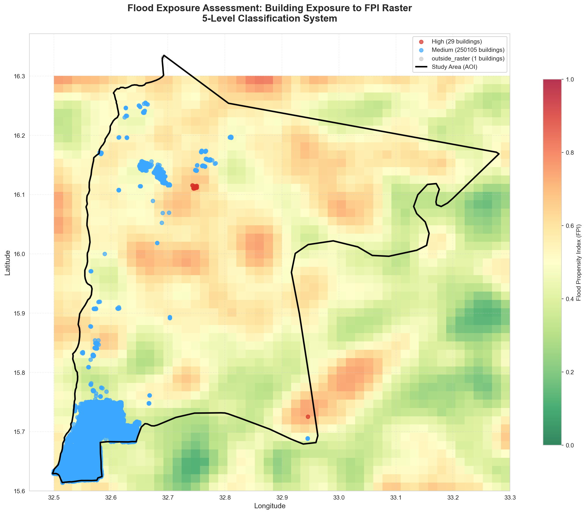
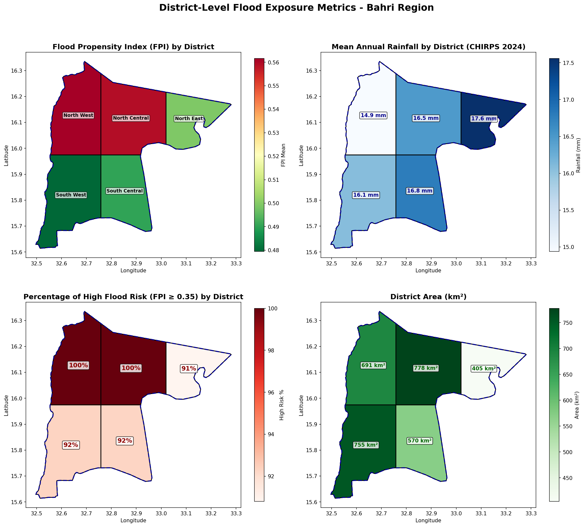

# Flood Exposure Geospatial Pipeline

**Rainfall–Terrain Driven Flood Propensity Modelling and Exposure Assessment in the Nile Basin Region**

---

## Project Overview

This repository implements a reproducible geospatial analysis pipeline for **flood propensity modelling** and **exposure assessment** in the Nile Basin region (Bahri area, Sudan). The workflow integrates multi-year satellite-derived rainfall data with DEM-derived hydrological products to generate a Flood Propensity Index (FPI), which is then used to quantify building and population exposure to flood hazards.

### Scientific Objective

To develop a spatially explicit flood propensity model that:
1. Combines **hydro-meteorological indicators** (mean rainfall, extreme precipitation, rainfall variability) with **terrain-based indicators** (flow accumulation, slope)
2. Produces a normalised **Flood Propensity Index (FPI)** ranging from 0 (low propensity) to 1 (high propensity)
3. Enables **raster–vector integration** to assess building and population exposure within flood-prone areas

### Problem Statement

Flood exposure assessment requires integration of:
- **Hazard characterisation**: Where is flooding likely to occur? (derived from rainfall patterns and terrain morphology)
- **Exposure quantification**: What assets and populations are located in hazard-prone areas?

This pipeline addresses both components using open-source geospatial tools and reproducible scientific workflows.

---

## Methodological Summary

The analysis follows a sequential data processing and modelling chain:

```
┌─────────────────────────────────────────────────────────────────────────────┐
│                          DATA ACQUISITION                                    │
├─────────────────────────────────────────────────────────────────────────────┤
│  CHIRPS Monthly Rainfall (2018–2025)  │  DEM Raster  │  Building Footprints │
│  (local netCDF files)                 │  (GeoTIFF)   │  (Overpass API/local)│
└───────────────┬───────────────────────┴──────┬───────┴──────────┬───────────┘
                │                              │                  │
                ▼                              ▼                  │
┌───────────────────────────────┐  ┌───────────────────────────┐  │
│   RAINFALL PROCESSING         │  │   DEM PROCESSING          │  │
│   • Merge multi-year files    │  │   • Fill depressions      │  │
│   • Clip to AOI               │  │   • Calculate slope       │  │
│   • Create 3D datacube        │  │   • Flow direction (D8)   │  │
│     (time × lat × lon)        │  │   • Flow accumulation     │  │
└───────────────┬───────────────┘  └───────────────┬───────────┘  │
                │                                  │              │
                ▼                                  ▼              │
┌───────────────────────────────────────────────────────────────┐ │
│                  INDICATOR EXTRACTION                          │ │
│  Rainfall Indicators:        Terrain Indicators:               │ │
│  • R1: Mean annual rainfall  • T1: Flow accumulation (log)     │ │
│  • R2: 95th percentile       • T2: Inverted slope              │ │
│  • R3: Coefficient of var.                                     │ │
└───────────────────────────────────┬───────────────────────────┘ │
                                    │                             │
                                    ▼                             │
┌───────────────────────────────────────────────────────────────┐ │
│              FLOOD PROPENSITY INDEX (FPI)                      │ │
│  • Normalise all indicators to [0, 1]                          │ │
│  • Weighted combination: FPI = Σ(wᵢ × Iᵢ)                      │ │
│  • Output: FPI raster (netCDF)                                 │ │
└───────────────────────────────────┬───────────────────────────┘ │
                                    │                             │
                                    ▼                             ▼
┌─────────────────────────────────────────────────────────────────────────────┐
│                        EXPOSURE ASSESSMENT                                   │
│  • Raster–vector integration: sample FPI at building centroids              │
│  • 5-level exposure classification: No Exposure → Very High                 │
│  • Population estimation: 6 persons per building (household assumption)     │
│  • Zonal statistics by administrative zone                                   │
└───────────────────────────────────────────────────────────────────────────────┘
```

---

## Repository Structure

```
flood-exposure-geospatial-pipeline/
│
├── src/                              # Source code modules
│   ├── _01_data_loading/             # Data acquisition and loading
│   │   ├── buildings.py              # Building data from Overpass API + processing
│   │   └── rainfall_processing.py    # CHIRPS data loading, merging, clipping
│   │
│   ├── _02_processing/               # Data processing and transformation
│   │   ├── cubes.py                  # Geospatial data cube operations (xarray)
│   │   ├── dem_processing.py         # DEM loading, depression filling, slope calculation
│   │   └── tensors.py                # Multi-dimensional tensor operations (PyTorch/NumPy)
│   │
│   └── _03_analysis/                 # Analysis and modelling
│       ├── hydrology.py              # Flow direction (D8), flow accumulation, watersheds
│       ├── flood_propensity.py       # FPI computation (rainfall + terrain indicators)
│       └── exposure.py               # Building/population exposure assessment
│
├── notebooks/                        # Jupyter notebooks (analysis entry points)
│   ├── cubes_tensors_demo.ipynb      # Datacube and tensor processing demonstration
│   ├── hydrology_analysis.ipynb      # Hydrological modelling and FPI generation
│   ├── flood_exposure_assessment.ipynb  # Building/population exposure analysis
│   └── Visulization.ipynb            # Output visualisation and mapping
│
├── data/
│   ├── raw/                          # Input data (user-provided or downloaded)
│   │   ├── raster/
│   │   └── vector/
│   │    
│   └── processed/                    # Intermediate outputs (generated by pipeline)
│
├── outputs/                          # Final outputs (maps, figures, exports)
│
├── docs/                             # Documentation
│   ├── EXPOSURE_ASSESSMENT_GUIDE.md  # Technical guide for exposure module
│   ├── FLOOD_EXPOSURE_QUICKSTART.md  # Quick start instructions
│   └── README.md                     # Documentation index
│
├── tests/                            # Unit tests (pytest)
├── cache/                            # API response cache (Overpass API)
├── requirements.txt                  # Python dependencies (pip)
├── pyproject.toml                    # Project configuration (Poetry)
├── LICENSE                           # MIT License
└── README.md                         # This file
```

---

## Data Sources

### 1. Rainfall Data (CHIRPS)

| Attribute | Value |
|-----------|-------|
| **Source** | Climate Hazards Group InfraRed Precipitation with Station data (CHIRPS) |
| **Temporal resolution** | Monthly |
| **Spatial resolution** | 0.05° (~5.5 km) |
| **Period covered** | 2018–2025 (7 years) |
| **Format** | NetCDF (.nc) |
| **Acquisition** | Local files in `data/raw/raster/Chirps_rainfall/` |

**Expected files:**
```
chirps-v2.0.2018.monthly.nc
chirps-v2.0.2019.monthly.nc
chirps-v2.0.2020.monthly.nc
...
chirps-v2.0.2025.monthly.nc
```

CHIRPS data is publicly available from [https://www.chc.ucsb.edu/data/chirps](https://www.chc.ucsb.edu/data/chirps).

### 2. Digital Elevation Model (DEM)

| Attribute | Value |
|-----------|-------|
| **Source** | User-provided (SRTM, ASTER GDEM, or equivalent) |
| **Format** | GeoTIFF |
| **Location** | `data/raw/raster/DEM2.tif` |
| **CRS** | EPSG:4326 (WGS84) expected |

The DEM is used to derive:
- Depression-filled surface for hydrological analysis
- Slope (degrees)
- D8 flow direction
- Flow accumulation

### 3. Building Footprints

| Attribute | Value |
|-----------|-------|
| **Source** | OpenStreetMap via Overpass API |
| **Format** | GeoJSON |
| **Acquisition** | API-based (`src/_01_data_loading/buildings.py`) or local |
| **Location** | `data/raw/vector/buildings/buildings_aoi.geojson` |

The pipeline can fetch building data dynamically from the Overpass API or use pre-downloaded GeoJSON files.

### 4. Area of Interest (AOI)

| Attribute | Value |
|-----------|-------|
| **Format** | ESRI Shapefile |
| **Location** | `data/raw/vector/AOI.shp` (+ .dbf, .prj, .shx) |
| **Region** | Bahri (Khartoum North), Sudan |

---

## Workflow Execution

### Prerequisites

1. **Python 3.11+** with dependencies installed
2. Required data files in expected locations (see Data Sources)

### Step-by-Step Execution Order

| Step | Notebook/Script | Purpose |
|------|-----------------|---------|
| 1 | `exploratory_analysis.ipynb` | Load and visualise DEM, verify data integrity |
| 2 | `cubes_tensors_demo.ipynb` | Process rainfall datacube, demonstrate tensor operations |
| 3 | `hydrology_analysis.ipynb` | Compute terrain indicators, generate FPI raster |
| 4 | `flood_exposure_assessment.ipynb` | Assess building/population exposure, generate metrics |
| 5 | `Visulization.ipynb` | Create final maps and figures |

### Alternative: Module-Based Execution

```python
# Example: Generate FPI from command line
from src._01_data_loading.rainfall_processing import CHIRPSProcessor
from src._02_processing.dem_processing import load_dem, fill_depressions, calculate_slope
from src._03_analysis.hydrology import calculate_flow_direction, calculate_flow_accumulation
from src._03_analysis.flood_propensity import compute_flood_propensity_index

# Load and process data
processor = CHIRPSProcessor(chirps_dir="data/raw/raster/Chirps_rainfall",
                            aoi_path="data/raw/vector/AOI.shp")
rainfall_cube = processor.merge_chirps_files()
clipped_cube = processor.clip_to_aoi()

# DEM processing
dem, meta = load_dem("data/raw/raster/DEM2.tif")
dem_filled = fill_depressions(dem)
slope = calculate_slope(dem_filled, cellsize=30)

# Hydrology
flow_dir = calculate_flow_direction(dem_filled)
flow_acc = calculate_flow_accumulation(flow_dir)

# Compute FPI
fpi = compute_flood_propensity_index(rainfall_cube, dem_filled, slope, flow_acc)
```

---

## Modelling Components

### Rainfall Indicators

| Indicator | Symbol | Description | Interpretation |
|-----------|--------|-------------|----------------|
| Mean rainfall | R₁ | Temporal mean across all months | Baseline moisture availability |
| 95th percentile | R₂ | Upper tail of precipitation distribution | Extreme event propensity |
| Coefficient of variation | R₃ | σ / μ of monthly values | Saturation dynamics / variability |

### Terrain Indicators

| Indicator | Symbol | Description | Interpretation |
|-----------|--------|-------------|----------------|
| Flow accumulation | T₁ | Upslope contributing area (D8 algorithm) | Water concentration potential |
| Inverted slope | T₂ | 1 / tan(slope) | Flat areas → higher propensity |

### Topographic Wetness Index (TWI)

The TWI quantifies the tendency of water to accumulate at a location based on topography:

$$TWI = \ln\left(\frac{a}{\tan(\beta)}\right)$$

Where:
- $a$ = specific catchment area (flow accumulation × cell size, m²)
- $\beta$ = local slope angle (radians)

**Interpretation:** High TWI values indicate areas where water tends to accumulate (valleys, flat areas), while low values indicate well-drained slopes.

### Flood Propensity Index (FPI)

The FPI is computed as a weighted combination of normalised indicators:

$$FPI = w_1 \cdot R_1' + w_2 \cdot R_2' + w_3 \cdot R_3' + w_4 \cdot T_1' + w_5 \cdot T_2'$$

Where:
- $R_1'$ = normalised mean rainfall [0, 1]
- $R_2'$ = normalised 95th percentile rainfall [0, 1]
- $R_3'$ = normalised coefficient of variation [0, 1]
- $T_1'$ = normalised log(flow accumulation) [0, 1]
- $T_2'$ = normalised inverted slope [0, 1]
- $w_i$ = weights (default: 0.2 each, sum to 1.0)

**Normalisation:** Min-max scaling applied per indicator:

$$I' = \frac{I - I_{min}}{I_{max} - I_{min}}$$

Default weights: equal weighting (0.2 each). Weights can be adjusted based on domain expertise or sensitivity analysis.

### Exposure Classification

| Class | FPI Range | Risk Level |
|-------|-----------|------------|
| No Exposure | FPI = 0 | None |
| Low | 0 < FPI < 0.15 | Low |
| Medium | 0.15 ≤ FPI < 0.35 | Moderate |
| High | 0.35 ≤ FPI < 0.65 | High |
| Very High | FPI ≥ 0.65 | Critical |

### Population Estimation

**Assumption:** 6 persons per building (average household size for the Nile Basin region).

```
Population = N_buildings × 6
Exposed_Population = N_exposed_buildings × 6
```

---

## Visualisation & Outputs

### Generated Figures

The pipeline produces 7 key visualizations organized by analysis phase:

---

#### **Part A: Rainfall Analysis**

**1. Average Monthly Rainfall Time Series**



*Temporal trend of mean monthly rainfall across the AOI (2018-2025) showing seasonal patterns and inter-annual variability.*

---

**2. Monthly Rainfall Pattern by Year**



*Year-over-year comparison of monthly rainfall highlighting the wet season (July-September) peak across all years.*

---

#### **Part B: DEM & Hydrological Analysis**

**3. Digital Elevation Model (DEM)**



*Terrain elevation map showing topographic variation across the Bahri region with AOI boundary overlay.*

---

**4. Flood Propensity Index (FPI)**



*Continuous FPI raster (0-1 scale) showing spatial distribution of flood-prone areas based on rainfall and terrain indicators.*

---

**5. Multi-Factor Comparison: DEM, Flow, TWI, FPI, Rainfall**



*6-panel comparative analysis integrating elevation, flow accumulation, topographic wetness, flood propensity, risk categories, and rainfall.*

---

#### **Part C: Flood Exposure Assessment**

**6. Building Exposure Map**



*Building footprints overlaid on FPI raster showing spatial distribution of exposed structures by risk level.*

---

**7. District-Level Flood Metrics**



*4-panel choropleth showing FPI mean, rainfall, high-risk percentage, and area by administrative district.*

---

### Vector Outputs

| Output | Description |
|--------|-------------|
| `data/processed/district_metrics.geojson` | District-level flood metrics (FPI, rainfall, area, risk %) |
| `outputs/buildings_aoi.geojson` | Building footprints with exposure attributes |
| `outputs/zone_exposure_metrics.geojson` | Zonal statistics (FPI mean, buildings, population) |

### Raster Outputs

| Output | Description |
|--------|-------------|
| `data/processed/flood_propensity_index.nc` | Final FPI raster (netCDF) |
| `data/processed/rainfall_datacube_aoi.nc` | Merged rainfall cube |
| `data/processed/dem_filled.tif` | Depression-filled DEM |
| `data/processed/slope.tif` | Slope in degrees |

---

## Reproducibility

### Environment Setup

**Using pip:**
```bash
python -m venv .venv
.venv\Scripts\activate  # Windows
pip install -r requirements.txt
pip install -e .  # Install package in editable mode
```

**Using Poetry:**
```bash
# Install Poetry (if not already installed)
pip install poetry

# Install all dependencies
poetry install

# Activate the Poetry shell
poetry shell
```

### Running the Package

**Option 1: Activate environment first (recommended)**
```bash
# Using pip/venv
.venv\Scripts\activate
pytest tests/ -v --cov=src --cov-report=term

# Using Poetry
poetry shell
pytest tests/ -v --cov=src --cov-report=term
```

**Option 2: Run commands directly through Poetry**
```bash
# Run tests
poetry run pytest tests/ -v --cov=src --cov-report=term

# Run Python scripts
poetry run python your_script.py

# Start Jupyter notebook
poetry run jupyter notebook
```

**Option 3: Use full path without activation**
```bash
.\.venv\Scripts\python.exe -m pytest tests/ -v --cov=src
```

### Importing Modules

Once installed, import modules from anywhere:
```python
from src._01_data_loading import buildings, rainfall_processing
from src._02_processing import cubes, tensors, dem_processing
from src._03_analysis import hydrology, flood_propensity, exposure
```

### Running Tests

```bash
pytest tests/ -v --cov=src --cov-report=term
```

### Determinism

- Random seeds are set where applicable (e.g., synthetic data generation)
- All spatial operations use explicit CRS (EPSG:4326)
- Floating-point operations may exhibit minor platform-dependent variation

### Performance Notes

- **DEM processing**: Depression filling and flow accumulation scale O(n²) for n pixels; large DEMs (>10000×10000) may require substantial memory
- **Building exposure**: Point-in-raster sampling is O(n) for n buildings; ~250,000 buildings process in <30 seconds
- **Datacube operations**: xarray with Dask backend recommended for very large rainfall archives

---

## Limitations & Assumptions

### Model Scope

1. **Propensity, not prediction**: FPI represents relative flood likelihood, not absolute flood depth or probability
2. **Static analysis**: Temporal dynamics (event-based flooding) not modelled; FPI represents long-term propensity
3. **No hydraulic modelling**: No 2D flood routing; terrain-based approximation only

### Data Constraints

1. **Population assumption**: Uniform 6 persons/building ignores building type and urban density variation
2. **Centroid sampling**: Buildings are represented by centroids; large buildings spanning multiple FPI cells may be misclassified
3. **DEM resolution**: Coarse DEMs underestimate local terrain features affecting water flow
4. **CHIRPS resolution**: 0.05° resolution smooths local rainfall variability

### Intended Use

- Regional-scale flood exposure screening
- Prioritisation of areas for detailed hydrological study
- Educational demonstration of raster–vector integration techniques

**Not intended for:**
- Site-specific flood risk engineering
- Insurance underwriting without validation
- Emergency response decision-making

---

## Citation & Credits

### Data Sources

- **CHIRPS**: Funk, C., et al. (2015). The climate hazards infrared precipitation with stations—a new environmental record for monitoring extremes. *Scientific Data*, 2, 150066. [https://doi.org/10.1038/sdata.2015.66](https://doi.org/10.1038/sdata.2015.66)

- **OpenStreetMap**: © OpenStreetMap contributors. Data available under the Open Database License (ODbL). [https://www.openstreetmap.org](https://www.openstreetmap.org)

### Software Dependencies

- **xarray**: Hoyer, S., & Hamman, J. (2017). xarray: N-D labeled arrays and datasets in Python. *Journal of Open Research Software*, 5(1).
- **GeoPandas**: Jordahl, K., et al. (2020). geopandas/geopandas: v0.8.1.
- **Rasterio**: Gillies, S., et al. (2013–). Rasterio: geospatial raster I/O for Python programmers.

### Methodological References

- O'Callaghan, J. F., & Mark, D. M. (1984). The extraction of drainage networks from digital elevation data. *Computer Vision, Graphics, and Image Processing*, 28(3), 323-344.
- Jenson, S. K., & Domingue, J. O. (1988). Extracting topographic structure from digital elevation data for geographic information system analysis. *Photogrammetric Engineering and Remote Sensing*, 54(11), 1593-1600.

---

## License

This project is licensed under the MIT License. See [LICENSE](LICENSE) for details.

---

## Contact

For questions or contributions, please open an issue on this repository.
